# Configuración Profesional de ZSH en Termux




## Índice

- [Introducción](#introducción)
- [Preparación del Entorno](#preparación-del-entorno)
- [Instalación de Componentes Esenciales](#instalación-de-componentes-esenciales)
- [Configuración de Oh-My-Zsh](#configuración-de-oh-my-zsh)
- [Personalización con Powerlevel10k](#personalización-con-powerlevel10k)
- [Mejoras de Productividad](#mejoras-de-productividad)
  - [Autosugerencias](#autosugerencias)
  - [Resaltado de Sintaxis](#resaltado-de-sintaxis)
- [Configuración del Teclado](#configuración-del-teclado)
- [Personalización del Esquema de Colores](#personalización-del-esquema-de-colores)
- [Optimizaciones Avanzadas](#optimizaciones-avanzadas)
- [Solución de Problemas](#solución-de-problemas)
- [Referencias](#referencias)

## Introducción

Termux es un emulador de terminal y entorno Linux para Android que permite ejecutar un sistema similar a Linux sin necesidad de root. Al combinarlo con ZSH y varias herramientas de personalización, obtendrás un entorno de terminal potente, eficiente y visualmente atractivo que aumentará significativamente tu productividad.

Este documento detalla una configuración profesional paso a paso para transformar Termux en un entorno de desarrollo completo, con énfasis en rendimiento, usabilidad y estética.

## Preparación del Entorno

Antes de comenzar con la personalización avanzada, debemos asegurarnos de que el entorno base está actualizado y correctamente configurado.

```bash
# Actualizar repositorios y paquetes
apt update
apt upgrade -y

# Configurar acceso al almacenamiento (crucial para backups y transferencia de archivos)
termux-setup-storage

# Desactivar mensaje de bienvenida para una experiencia más limpia
touch ~/.hushlogin
```

> **NOTA EXPERTA:** La opción `-y` en el comando `upgrade` confirma automáticamente todas las instalaciones, mientras que `termux-setup-storage` es esencial para interactuar con el sistema de archivos de Android, permitiéndote acceder a los directorios `/sdcard/` y `/storage/`.

El archivo `.hushlogin` es un método estándar en sistemas Unix para suprimir el mensaje de bienvenida, proporcionando un inicio más limpio y rápido.

## Instalación de Componentes Esenciales

Instalaremos un conjunto cuidadosamente seleccionado de herramientas que conformarán la base de nuestro entorno productivo:

```bash
pkg install git micro zsh bat lsd -y
```

Cada herramienta cumple un propósito específico:

- **git**: Sistema de control de versiones, esencial para instalar y actualizar plugins
- **micro**: Editor de texto moderno, más intuitivo que nano o vim para principiantes
- **zsh**: Shell avanzado con numerosas mejoras sobre bash
- **bat**: Alternativa moderna a `cat` con resaltado de sintaxis
- **lsd**: Reemplazo mejorado para `ls` con íconos y colores

> **SUGERENCIA EXPERTA:** Considera añadir `ncurses-utils` para soporte de terminal mejorado, `openssh` para conectividad remota, y `python` como lenguaje de scripting versátil.

## Configuración de Oh-My-Zsh

Oh-My-Zsh es un framework de gestión de configuración para ZSH que simplifica enormemente la administración de temas y plugins:

```bash
sh -c "$(curl -fsSL https://raw.githubusercontent.com/robbyrussell/oh-my-zsh/master/tools/install.sh)"
```

> **NOTA EXPERTA:** Utilizo la URL directa al script de instalación original en lugar de versiones modificadas para garantizar la máxima compatibilidad y seguridad. El parámetro `-fsSL` de curl optimiza la descarga para entornos móviles: `-f` (fallar silenciosamente), `-s` (modo silencioso), `-S` (mostrar errores) y `-L` (seguir redirecciones).

Durante la instalación, se te preguntará si deseas establecer ZSH como shell predeterminado. Recomiendo aceptar esta opción para aprovechar inmediatamente las ventajas de ZSH.

## Personalización con Powerlevel10k

Powerlevel10k es actualmente el tema más potente y eficiente para ZSH, con un rendimiento significativamente superior a alternativas como Agnoster o Powerlevel9k:

```bash
# Clonar el repositorio en el directorio home
git clone --depth=1 https://github.com/romkatv/powerlevel10k.git ~/powerlevel10k

# Añadir la configuración al archivo .zshrc
echo 'source ~/powerlevel10k/powerlevel10k.zsh-theme' >>~/.zshrc
```

> **NOTA EXPERTA:** La opción `--depth=1` realiza una clonación superficial, descargando solo el commit más reciente. Esto reduce drásticamente el tamaño de la descarga y es ideal para dispositivos móviles con limitaciones de almacenamiento.

Después de instalar Powerlevel10k, debes abrir una nueva terminal para iniciar el proceso de configuración interactivo. Si en algún momento deseas reconfigurarlo:

```bash
p10k configure
```

Durante la configuración, considera las siguientes recomendaciones:

1. Selecciona una fuente compatible con Nerd Fonts para obtener todos los íconos
2. Para terminales móviles, elige el estilo "Classic" que es más compacto
3. Activa los segmentos de git, directorio y estado del comando
4. Desactiva elementos que consuman espacio horizontal innecesario

## Mejoras de Productividad

### Autosugerencias

El plugin de autosugerencias predice comandos basándose en tu historial, lo que acelera significativamente la entrada de comandos frecuentes:

```bash
# Crear directorio dedicado para plugins
mkdir -p ~/.plugins/zsh-autosuggestions

# Clonar el repositorio e integrar con ZSH
git clone --depth 1 https://github.com/zsh-users/zsh-autosuggestions.git ~/.plugins/zsh-autosuggestions
echo "source ~/.plugins/zsh-autosuggestions/zsh-autosuggestions.zsh" >> $HOME/.zshrc

# Recargar la configuración
termux-reload-settings
```

> **SUGERENCIA EXPERTA:** Para optimizar la experiencia con autosugerencias, añade estas configuraciones a tu `.zshrc`:
> 
> ```bash
> # Optimización de autosugerencias
> ZSH_AUTOSUGGEST_STRATEGY=(history completion)
> ZSH_AUTOSUGGEST_BUFFER_MAX_SIZE=20
> ZSH_AUTOSUGGEST_USE_ASYNC=true
> ```
> 
> Esto mejora significativamente el rendimiento en dispositivos móviles menos potentes.

### Resaltado de Sintaxis

El resaltado de sintaxis ayuda a prevenir errores al colorear comandos según su validez:

```bash
# Crear directorio dedicado
mkdir -p ~/.plugins/zsh-syntax-highlighting

# Clonar el repositorio e integrar con ZSH
git clone --depth 1 https://github.com/zsh-users/zsh-syntax-highlighting.git ~/.plugins/zsh-syntax-highlighting
echo "source ~/.plugins/zsh-syntax-highlighting/zsh-syntax-highlighting.zsh" >> $HOME/.zshrc

# Recargar la configuración
termux-reload-settings
```

> **NOTA EXPERTA:** El orden de carga de los plugins es importante. Siempre carga zsh-syntax-highlighting al final para asegurar que pueda procesar correctamente todos los comandos y alias definidos previamente.

## Configuración del Teclado

La configuración del teclado virtual en Termux es crucial para una experiencia de usuario fluida, especialmente para comandos que usan teclas especiales:

```bash
# Crear directorio si no existe
mkdir -p ~/.termux

# Crear archivo de configuración de teclas
cat > ~/.termux/termux.properties << 'EOF'
extra-keys = [['ESC','|','-', {key: HOME, display: 'INC'},'UP',{key: END, display: 'FIN'}, 'APOSTROPHE', {macro: "clear ENTER", display: '×'}],['TAB','CTRL','BACKSLASH','LEFT','DOWN','RIGHT','KEYBOARD','DEL'] ]
EOF

# Reiniciar Termux para aplicar cambios
termux-reload-settings
```

> **ANÁLISIS EXPERTO:** Esta configuración de teclado está cuidadosamente diseñada para maximizar la eficiencia:
> 
> - Teclas de escape y control accesibles para uso con vim y otros editores
> - Navegación completa (flechas, HOME, END)
> - Macro para limpiar pantalla con un solo toque
> - Caracteres especiales frecuentes en línea de comandos (|, \, -)

Puedes personalizar aún más este teclado según tus necesidades específicas.

## Personalización del Esquema de Colores


Un esquema de colores bien diseñado no solo mejora la estética sino también la legibilidad y reduce la fatiga visual:

Configurar colores para extensiones específicas en el archivo `.zshrc`

Añade estas líneas al final del archivo:

```bash
# Configurar colores personalizados para ls
export LS_COLORS="*.html=31:*.css=36:*.js=33:*.php=35:$LS_COLORS"
alias ls='lsd --color=auto'
```

Con esta configuración:
- Archivos HTML: color rojo (31)
- Archivos CSS: color cian (36)
- Archivos JS: color amarillo (33)
- Archivos PHP: color magenta (35)


______________________

```bash
# Crear archivo de configuración de colores
cat > ~/.termux/colors.properties << 'EOF'
color0=#303030
#Red
color1=#8B0000
#line green
color2=#6AEB36
#yelloy
color3=#F5B337
#blue
color4=#6F7CEF
#pink
color5=#F537C2
#cyan
color6=#31DEEF
#lead
color7=#8a8a8a
#black
color8=#494949
#Red Terminal
color9=#EE146F
#green
color10=#4FDA15
#yellow
color11=#F4C82D
#Carpetas
color12=#6F6FFC
#mutimedia
color13=#b03b76
#cyan
color14=#13CDAF
#lead
color15=#cfcfcf

background=#1A1A1E
foreground=#d9e6f2
cursor=#d9e6f2
EOF

# Aplicar cambios
termux-reload-settings
```

> **ANÁLISIS CROMÁTICO:** Este esquema de colores está diseñado con principios de diseño de UI/UX:
> 
> - Contraste optimizado para pantallas AMOLED
> - Diferenciación clara entre tipos de archivos y directorios
> - Azul reducido para minimizar fatiga ocular en sesiones nocturnas
> - Fondo oscuro que ahorra batería en dispositivos modernos

### Esquema de Colores Alternativo

Si prefieres un esquema más sutil, puedes usar esta configuración alternativa:

```bash
cat > ~/.termux/colors.properties << 'EOF'
color0=#303030
#Red
color1=#a87139
#line green
color2=#6AEB36
color3=#71a839
color4=#7139a8
color5=#a83971
color6=#3971a8
color7=#8a8a8a
#black
color8=#494949
#Red Terminal
color9=#EE146F
color10=#3bb076
color11=#76b03b
#Carpetas
color12=#6F6FFC
color13=#b03b76
color14=#3b76b0
color15=#cfcfcf
background=#1A1A1E
foreground=#d9e6f2
cursor=#d9e6f2
EOF

termux-reload-settings
```

## Optimizaciones Avanzadas

Para llevar tu configuración de ZSH al siguiente nivel, considera estas optimizaciones avanzadas:

### Aliases Útiles

Añade estos alias a tu `.zshrc` para aumentar tu productividad:

```bash
# Navegación mejorada
alias ..='cd ..'
alias ...='cd ../..'
alias ....='cd ../../..'

# Sustitución de comandos estándar por alternativas mejoradas
alias ls='lsd'
alias cat='bat'
alias nano='micro'

# Comandos frecuentes abreviados
alias g='git'
alias rm='rm -i'  # Modo interactivo para prevenir eliminaciones accidentales
alias x='exit'
alias c='clear'

# Información del sistema
alias uso='du -h -d1'
alias memoria='free -m'
alias bateria='termux-battery-status'
```

### Plugins Recomendados para Oh-My-Zsh

Edita tu archivo `.zshrc` y busca la línea `plugins=(git)`. Reemplázala con:

```bash
plugins=(
  git
  colored-man-pages
  command-not-found
  history
  extract
  z
)
```

> **ANÁLISIS EXPERTO:** Estos plugins están seleccionados por su bajo impacto en el rendimiento y alta utilidad en un entorno móvil:
> 
> - `z`: Navegación rápida a directorios frecuentes sin escribir rutas completas
> - `extract`: Extrae cualquier archivo comprimido con un solo comando (`x archivo.tar.gz`)
> - `colored-man-pages`: Mejora la legibilidad de las páginas de manual

### Optimización de Rendimiento

Para mejorar la velocidad de inicio de ZSH, especialmente en dispositivos menos potentes:

```bash
# Añadir al final de .zshrc
# Acelerar inicio de ZSH
zmodload zsh/zprof
DISABLE_UPDATE_PROMPT=true
DISABLE_AUTO_UPDATE=true
HIST_STAMPS="dd.mm.yyyy"
setopt HIST_IGNORE_ALL_DUPS
```

## Solución de Problemas

### Problemas con las Fuentes

Si los íconos de Powerlevel10k no se muestran correctamente:

1. Instala una fuente Nerd Font en tu dispositivo Android
2. Configura la terminal de Termux para usar esa fuente
3. Ejecuta `p10k configure` nuevamente

### Errores de Instalación de Plugins

Si encuentras errores durante la instalación de plugins:

```bash
# Verificar permisos
ls -la ~/ | grep -E "\.z|\.oh|\.plug"

# Corregir permisos si es necesario
chmod -R 755 ~/.oh-my-zsh
chmod -R 755 ~/.plugins
```

### Rendimiento Lento

Si notas lentitud al abrir terminales o ejecutar comandos:

```bash
# Añadir a .zshrc para diagnóstico
zmodload zsh/zprof
# Al final de .zshrc
zprof
```

Esto mostrará métricas de rendimiento para identificar plugins problemáticos.

## Referencias

- [Documentación oficial de Termux](https://termux.com/docs/)
- [Wiki de Oh-My-Zsh](https://github.com/ohmyzsh/ohmyzsh/wiki)
- [Repositorio de Powerlevel10k](https://github.com/romkatv/powerlevel10k)
- [Guía de Optimización de ZSH](https://blog.patshead.com/2011/04/improve-your-oh-my-zsh-startup-time-maybe.html)

---

*Documento creado por [CmbRDevMx](https://github.com/cmbrdevmx/) Configuración de entornos Unix con experiencia. Última actualización: Mayo 2025.*
